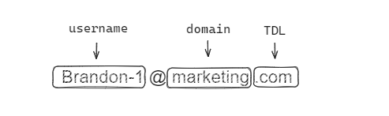

# Regex Tutorial

A regular expression (regex) is a pattern of characters that defines a specific search pattern. They can be used to validate inputs, replace a character or sequence within a string, and much more. This regex tutorial will breakdown the different elements of a regular expression, how to read a regex, and the proper use for given example listed below.

## Summary

The regular expression being broken down in this repository is an email address validator with the following structure:

- ensures that the email address starts with a valid username followed by an at (@) symbol and a valid domain name
- username can contain lowercase letters, digits, underscores, dots, and hyphens.
- domain name can contain digits,lowercase letters, dots, and hyphens.
- TLD (top level domain) must consist of 2 to 6 lowercase letters or dots.

Here is the regular expression that will be broken down

     - `/^([a-z0-9_\.-]+)@([\da-z\.-]+)\.([a-z\.]{2,6})$/`

Here is an example below:

## Table of Contents

## Regex Components

### Anchors

### Quantifiers

### Grouping Constructs

### Bracket Expressions

### Character Classes

### The OR Operator

### Flags

### Character Escapes

## Author

If you have any specific questions or if you'd like further clarification on any of these concepts, feel free to ask!

Please explore my github for a full overview of my [portfolio].

(https://github.com/brandonlambrecht)
